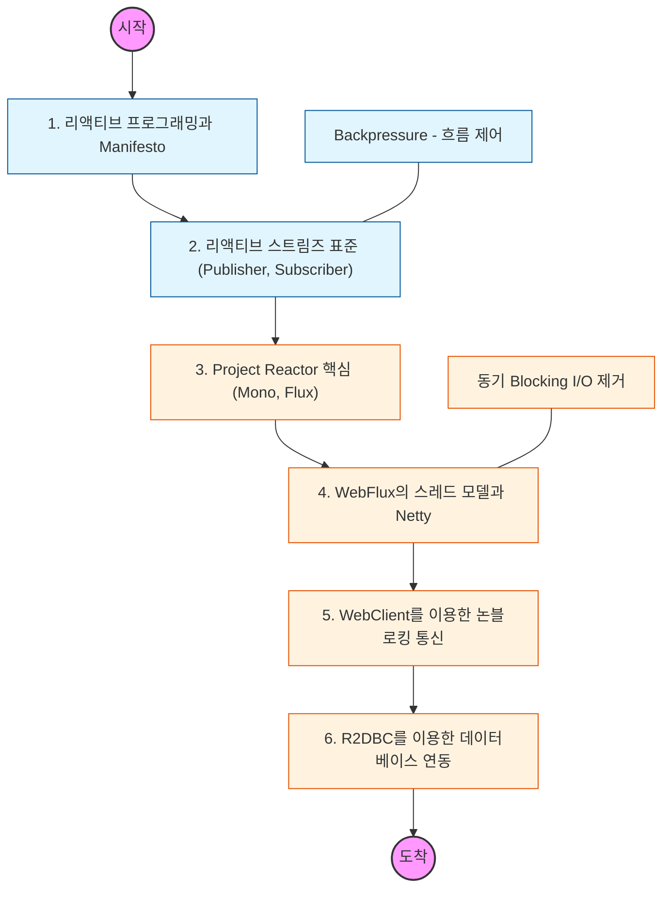

# 🧭 Spring WebFlux: 비동기 논블로킹 프로그래밍

> **해당 학습의 목표:** 리액티브 스트림(Reactive Streams)의 표준을 익히고, 적은 수의 스레드로 고성능 동시성 처리를 구현하는 능력을 갖추어야 함.

---

## 🛣️ Learning Roadmap

---

## 🔍 상세 학습 가이드

### **1. 리액티브 스트림즈(Reactive Streams) 표준**

* **내용:** `Publisher`, `Subscriber`, `Subscription`, `Processor` 간의 상호작용을 학습해야 함.
* **핵심:** 소비자가 처리할 수 있는 양만큼만 데이터를 보내도록 요청하는 **백프레셔(Backpressure)**의 개념을 반드시 파악해야 함.

### **2. Project Reactor: Mono와 Flux**

* **내용:** 0~1개의 데이터를 처리하는 `Mono`와 0~N개의 데이터를 처리하는 `Flux`의 차이를 익혀야 함.
* **Why?** 스트림 형태의 데이터를 가공하는 수많은 연산자(map, flatMap, zip, filter 등)를 자유자재로 다룰 수 있어야 함.

### **3. WebFlux 스레드 모델 (Event Loop)**

* **내용:** 서블릿 기반의 Thread-per-request 모델과 WebFlux의 Event Loop 모델의 차이를 분석해야 함.
* **주의:** 논블로킹 환경에서 단 하나의 블로킹 코드(예: Thread.sleep, JDBC)가 전체 시스템 성능을 어떻게 마비시키는지 이해하고, 이를 방지해야 함.

### **4. WebClient를 활용한 API 호출**

* **내용:** 기존의 RestTemplate을 대체하여 비동기 논블로킹 방식으로 외부 API를 호출하는 `WebClient` 사용법을 익혀야 함.
* **핵심:** 여러 API 호출을 병렬로 처리하고 결과를 조합하여 응답 시간을 획기적으로 단축하는 설계를 해야 함.

### **5. R2DBC와 리액티브 데이터 접근**

* **내용:** 관계형 데이터베이스에서도 논블로킹 통신을 지원하는 R2DBC(Reactive Relational Database Connectivity)를 학습해야 함.
* **상황:** 기존 JDBC 기반의 라이브러리와 WebFlux를 혼용할 때 발생하는 병목 현상을 인지하고, 진정한 End-to-End 논블로킹 스택을 구축해야 함.

---

## 🔗 관련 참고 자료

* [Spring WebFlux Official Documentation](https://docs.spring.io/spring-framework/reference/web/webflux.html)
* [Project Reactor Core Reference Guide](https://projectreactor.io/docs/core/release/reference/)