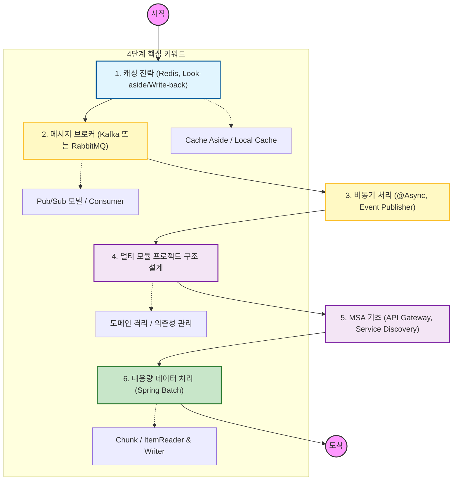

**대규모 트래픽 처리와 시스템 간의 연결**에 집중하는 단계

```mermaid
graph TD
    %% 스타일 정의
    classDef point fill:#f9f,stroke:#333,stroke-width:2px;
    classDef messaging fill:#fff9c4,stroke:#fbc02d,stroke-width:2px;
    classDef cache fill:#e1f5fe,stroke:#01579b,stroke-width:2px;
    classDef architecture fill:#f3e5f5,stroke:#7b1fa2,stroke-width:2px;
    classDef cloud fill:#c8e6c9,stroke:#2e7d32,stroke-width:2px;

    Start((시작)):::point --> Redis["1. 캐싱 전략 (Redis, Look-aside/Write-back)"]:::cache
    Redis --> Messaging["2. 메시지 브로커 (Kafka 또는 RabbitMQ)"]:::messaging
    Messaging --> Async["3. 비동기 처리 (@Async, Event Publisher)"]:::messaging
    Async --> MultiModule["4. 멀티 모듈 프로젝트 구조 설계"]:::architecture
    MultiModule --> MSA["5. MSA 기초 (API Gateway, Service Discovery)"]:::architecture
    MSA --> Batch["6. 대용량 데이터 처리 (Spring Batch)"]:::cloud
    Batch --> Finish((도착)):::point

    %% 상세 키워드 연결
    subgraph "4단계 핵심 키워드"
    Redis -.-> K1["Cache Aside / Local Cache"]
    Messaging -.-> K2["Pub/Sub 모델 / Consumer"]
    MultiModule -.-> K3["도메인 격리 / 의존성 관리"]
    Batch -.-> K4["Chunk / ItemReader & Writer"]
    end
```
