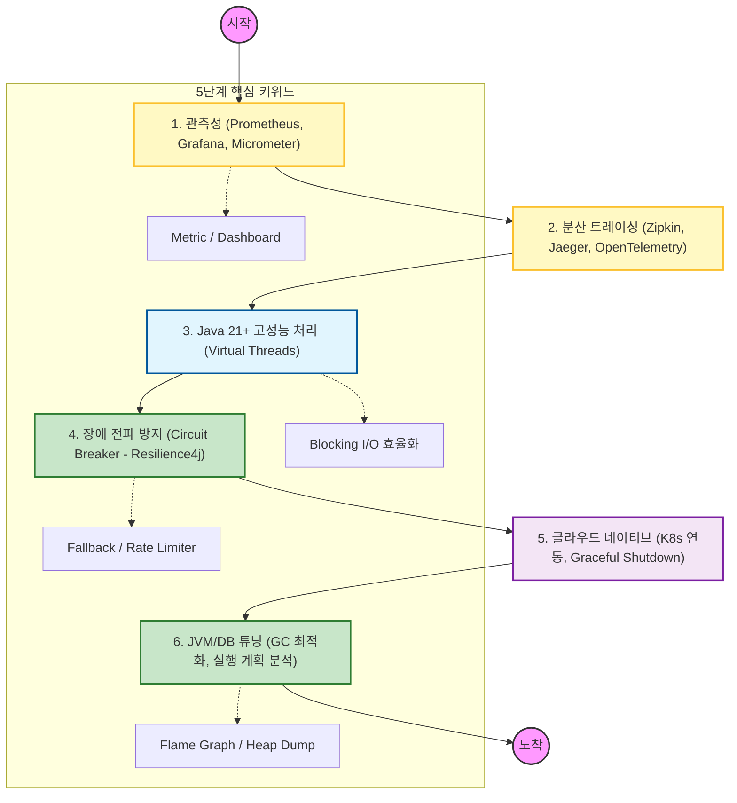

단순히 코드를 잘 짜는 것을 넘어, **시스템의 안정성을 수치로 증명하고, 어떤 장애 상황에서도 서비스가 지속될 수 있게 만드는 엔지니어링**의 영역

```mermaid
graph TD
    %% 스타일 정의
    classDef point fill:#f9f,stroke:#333,stroke-width:2px;
    classDef monitor fill:#fff9c4,stroke:#fbc02d,stroke-width:2px;
    classDef virtual fill:#e1f5fe,stroke:#01579b,stroke-width:2px;
    classDef cloud fill:#f3e5f5,stroke:#7b1fa2,stroke-width:2px;
    classDef reliability fill:#c8e6c9,stroke:#2e7d32,stroke-width:2px;

    Start((시작)):::point --> Monitoring["1. 관측성 (Prometheus, Grafana, Micrometer)"]:::monitor
    Monitoring --> DistributedTracing["2. 분산 트레이싱 (Zipkin, Jaeger, OpenTelemetry)"]:::monitor
    DistributedTracing --> VirtualThread["3. Java 21+ 고성능 처리 (Virtual Threads)"]:::virtual
    VirtualThread --> Resiliance["4. 장애 전파 방지 (Circuit Breaker - Resilience4j)"]:::reliability
    Resiliance --> CloudNative["5. 클라우드 네이티브 (K8s 연동, Graceful Shutdown)"]:::cloud
    CloudNative --> Performance["6. JVM/DB 튜닝 (GC 최적화, 실행 계획 분석)"]:::reliability
    Performance --> Finish((도착)):::point

    %% 상세 키워드 연결
    subgraph "5단계 핵심 키워드"
    Monitoring -.-> K1["Metric / Dashboard"]
    VirtualThread -.-> K2["Blocking I/O 효율화"]
    Resiliance -.-> K3["Fallback / Rate Limiter"]
    Performance -.-> K4["Flame Graph / Heap Dump"]
    end
```
