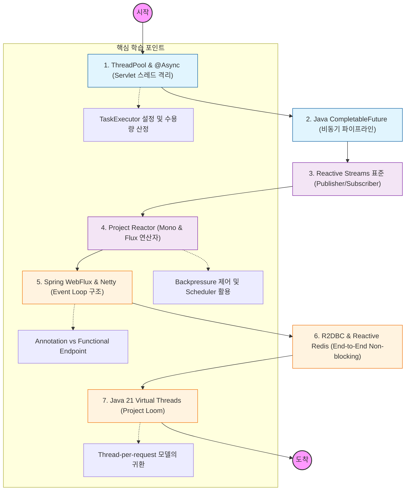

---

### 📝 단계별 상세 학습 가이드

### **1단계: 기존 방식의 한계와 @Async**

- **개념:** 동기(Blocking) 방식에서 특정 로직(메일 발송, 알림 등)을 별도 스레드로 분리하는 법.
- **학습 내용:** `TaskExecutor`의 종류와 설정, `@Async`가 프록시 패턴으로 동작한다는 점 이해하기.

### **2단계: CompletableFuture 마스터**

- **개념:** 자바 8부터 도입된 강력한 비동기 프로그래밍 도구.
- **학습 내용:** `thenApply`, `thenCompose`, `allOf` 등을 활용해 여러 비동기 작업을 조합하고 예외를 처리하는 법.

### **3단계: Reactive Streams와 Project Reactor**

- **개념:** 데이터 스트림을 논블로킹으로 처리하기 위한 표준 API.
- **학습 내용:** `Mono`(0~1개)와 `Flux`(0~N개)의 차이, `map`, `flatMap`, `zip` 등 수많은 연산자(Operator) 익히기.

### **4단계: Spring WebFlux & Event Loop**

- **개념:** 적은 수의 스레드로 대량의 요청을 처리하는 이벤트 루프 모델.
- **학습 내용:** Netty 서버의 동작 방식, `WebClient`를 이용한 논블로킹 외부 API 호출.

### **5단계: End-to-End 논블로킹 (R2DBC)**

- **개념:** API 서버만 논블로킹이어도 DB 드라이버가 블로킹이면 소용없음.
- **학습 내용:** JDBC의 한계를 넘는 `R2DBC` 사용법, Redis와 같은 NoSQL과의 리액티브 연동.

### **6단계: 현대적 대안 - Virtual Threads**

- **개념:** 리액티브 코드의 복잡성을 해결하기 위해 등장한 가상 스레드.
- **학습 내용:** Java 21의 가상 스레드가 리액티브 프로그래밍의 대안이 될 수 있는지, 어떤 상황에서 성능 이점이 있는지 비교 분석.
