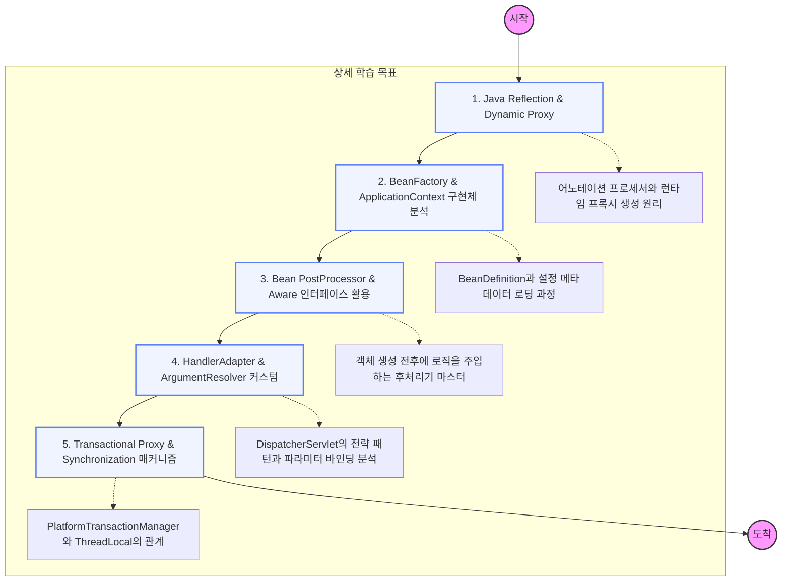

## 📝 각 단계별 학습 가이드 (무엇을 파고들어야 하는가)

### **1단계: Java Reflection & Proxy**

스프링의 모든 마법은 자바의 **리플렉션**에서 시작한다.

- 컴파일 타임이 아닌 런타임에 클래스 정보를 읽고 객체를 생성하는 법
- `java.lang.reflect.Proxy`와 `CGLIB` 라이브러리의 차이점 공부하기

### **2단계: Container & BeanDefinition**

`@Component`가 어떻게 객체가 되는지 그 '설계도'를 이해하는 단계.

- `BeanDefinitionReader`가 설정 정보를 읽어 `BeanDefinition`으로 만드는 과정
- `BeanFactory`와 `ApplicationContext` 계층 구조 분석하기

### **3단계: BeanPostProcessor & Lifecycle Hooks**

스프링이 제공하는 가장 강력한 확장 포인트.

- `BeanPostProcessor`를 구현해 빈 객체를 다른 객체로 바꿔치기하는 법 (AOP의 원리)
- `Aware` 인터페이스를 통해 스프링 엔진의 자원을 빈에 주입하는 메커니즘

### **4단계: MVC 전략 인터페이스 커스텀**

HTTP 요청을 내 마음대로 처리하는 고급 기술.

- `HandlerMethodArgumentResolver`를 직접 구현해 공통 파라미터 자동 주입하기
- `HandlerInterceptor`와 `Filter`의 호출 시점과 예외 처리 범위 차이 분석

### **5단계: Transaction & AOP Deep Dive**

가장 난이도가 높은 데이터 정합성과 관점 지향 프로그래밍의 실체.

- `TransactionAspectSupport` 내부 코드를 보며 어떻게 트랜잭션이 전파(Propagation)되는지 공부
- `TransactionSynchronizationManager`가 어떻게 스레드별로 커넥션을 관리하는지 이해
