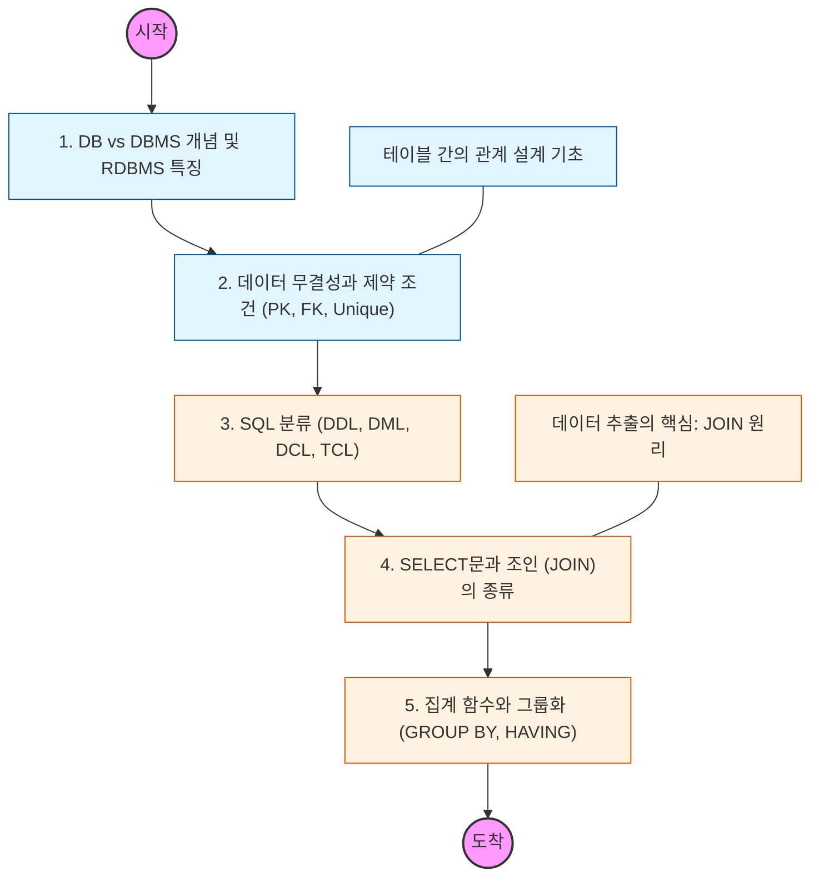

# 🧭 RDBMS 기초와 SQL 마스터

> **해당 학습의 목표:** 데이터베이스의 존재 이유를 파악하고, 관계형 모델의 핵심 개념을 이해하며 원하는 데이터를 자유롭게 추출하는 SQL 능력을 갖추어야 함.

---

## 🛣️ Learning Roadmap

---

## 🔍 상세 학습 가이드

### **1. RDBMS의 핵심 개념 이해**

* **내용:** 데이터를 표(Table) 형태로 관리하는 관계형 데이터베이스의 구조와 행(Row), 열(Column)의 개념을 파악해야 함.
* **Why?** 파일 시스템 관리와 비교했을 때 DB가 가지는 장점(데이터 중복 최소화, 동시성 제어 등)을 명확히 인지해야 함.

### **2. 데이터 무결성과 제약 조건**

* **내용:** 데이터를 식별하는 기본 키(PK), 테이블 간 연결고리인 외래 키(FK), 중복 방지를 위한 Unique 등 제약 조건을 학습해야 함.
* **핵심:** 무결성 제약 조건을 통해 데이터의 신뢰성을 어떻게 물리적으로 보장하는지 이해해야 함.

### **3. SQL(Structured Query Language) 분류**

* **내용:** 테이블을 정의하는 DDL, 데이터를 조작하는 DML, 권한을 제어하는 DCL, 트랜잭션을 관리하는 TCL의 차이를 구분해야 함.
* **상황:** 실무에서 가장 많이 사용하는 `SELECT`, `INSERT`, `UPDATE`, `DELETE` 문법을 능숙하게 구사할 수 있도록 연습해야 함.

### **4. JOIN: 흩어진 데이터 합치기**

* **내용:** `INNER JOIN`, `LEFT/RIGHT OUTER JOIN`, `SELF JOIN`의 차이를 벤다이어그램으로 그려가며 완벽히 이해해야 함.
* **Why?** 정규화된 테이블 구조에서 원하는 정보를 얻기 위해 여러 테이블을 효율적으로 결합하는 능력을 길러야 함.

### **5. 데이터 요약과 그룹화**

* **내용:** `COUNT`, `SUM`, `AVG` 등 집계 함수와 특정 기준별로 묶는 `GROUP BY` 문법을 마스터해야 함.
* **핵심:** `WHERE`절과 `HAVING`절의 실행 순서와 차이점을 명확히 구분하여 데이터를 필터링해야 함.

---

## 🔗 관련 참고 자료

* [W3Schools SQL Tutorial](https://www.w3schools.com/sql/) - 기초 문법 실습에 최적화
* [SQL 첫걸음 (아사이 아츠시 저)] - 비전공자도 이해하기 쉬운 DB 입문서