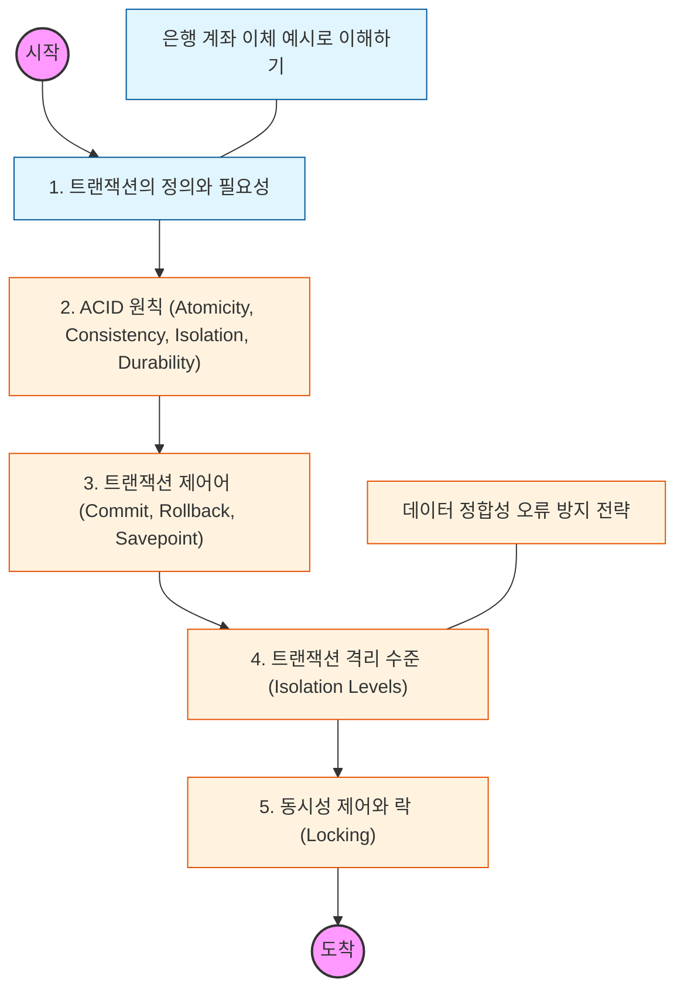

# 🧭 트랜잭션과 ACID

> **해당 학습의 목표:** "전부 실행되거나, 아예 실행되지 않거나"라는 트랜잭션의 본질을 파악하고, 데이터의 무결성을 보장하는 4가지 핵심 원칙을 마스터해야 함.

---

## 🛣️ Learning Roadmap

---

## 🔍 상세 학습 가이드

### **1. 트랜잭션(Transaction)의 개념**

* **내용:** 여러 개의 작업이 하나의 논리적 단위로 묶여서 처리되는 과정을 이해해야 함.
* **Why?** 은행 이체(A 계좌 출금 후 B 계좌 입금) 도중 오류가 났을 때, 돈만 빠져나가고 입금은 안 되는 최악의 상황을 방지하기 위해 필수적임.

### **2. ACID 원칙 파헤치기**

* **내용:** 트랜잭션이 안전하게 수행되기 위한 4가지 속성을 숙지해야 함.
* **원자성(Atomicity):** 전부 성공하거나 전부 실패해야 함.
* **일관성(Consistency):** 실행 전후의 데이터 규칙이 유지되어야 함.
* **격리성(Isolation):** 트랜잭션끼리 서로 간섭할 수 없어야 함.
* **지속성(Durability):** 성공한 결과는 시스템 장애가 나도 영구 보존되어야 함.

### **3. 트랜잭션 제어 (TCL)**

* **내용:** 작업을 확정 짓는 `COMMIT`과 작업을 취소하고 되돌리는 `ROLLBACK`의 동작 방식을 익혀야 함.
* **핵심:** `SAVEPOINT`를 사용하여 전체 취소가 아닌 특정 지점까지만 되돌리는 유연한 처리 기법도 파악해야 함.

### **4. 트랜잭션 격리 수준 (Isolation Level)**

* **내용:** 여러 트랜잭션이 동시에 실행될 때 성능과 데이터 정합성 사이의 트레이드오프(Trade-off)를 이해해야 함.
* **핵심:** `READ UNCOMMITTED`부터 `SERIALIZABLE`까지 4단계 수준을 공부하고, Dirty Read, Non-repeatable Read, Phantom Read와 같은 부작용을 어떻게 막는지 확인해야 함.

### **5. 동시성 제어와 락(Locking)**

* **내용:** 데이터 수정 중 다른 사용자가 접근하지 못하도록 막는 공유 락(Shared Lock)과 배타 락(Exclusive Lock)의 개념을 학습해야 함.
* **상황:** 교착 상태(Deadlock)가 발생하는 원인과 이를 해결하기 위한 최소한의 트랜잭션 설계 원칙을 세워야 함.

---

## 🔗 관련 참고 자료

* [Database Transaction (Wikipedia)](https://en.wikipedia.org/wiki/Database_transaction)
* [MySQL 공식 문서 - InnoDB Transaction Model](https://dev.mysql.com/doc/refman/8.0/en/innodb-transaction-model.html)