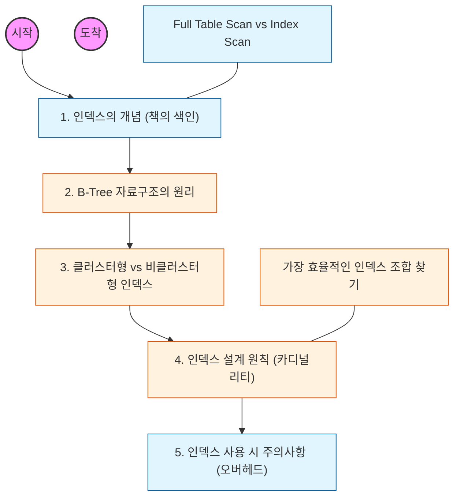

# 🧭 인덱스(Index) 기초와 성능 최적화

> **해당 학습의 목표:** 인덱스의 내부 자료구조를 이해하고, 어떤 컬럼에 인덱스를 걸어야 효율적인지 판단할 수 있는 기준을 세워야 함.

---

## 🛣️ Learning Roadmap

---

## 🔍 상세 학습 가이드

### **1. 인덱스의 본질 이해**

* **내용:** 테이블의 모든 행을 다 읽는 `Full Table Scan`과 필요한 부분만 찾아가는 `Index Scan`의 속도 차이를 체감해야 함.
* **Why?** 데이터가 많아질수록 인덱스 유무가 쿼리 속도를 수십, 수백 배 차이 나게 만들기 때문에 성능 최적화의 필수 요소임을 인지해야 함.

### **2. B-Tree(Balanced Tree) 자료구조**

* **내용:** 대부분의 RDBMS가 사용하는 B-Tree 구조가 어떻게 데이터를 정렬하고 탐색 시간을 $O(\log N)$으로 줄이는지 파악해야 함.
* **핵심:** 루트 노드, 브랜치 노드, 리프 노드 간의 관계와 데이터 탐색 경로를 도식화하여 이해해야 함.

### **3. 클러스터형 인덱스와 비클러스터형 인덱스**

* **내용:** 실제 데이터가 물리적으로 정렬되는 클러스터형(주로 PK)과, 별도의 인덱스 페이지를 생성하는 비클러스터형의 차이를 공부해야 함.
* **핵심:** 한 테이블에 클러스터형 인덱스는 단 하나만 존재할 수 있으며, 주소록처럼 실제 페이지를 찾는 방식임을 파악해야 함.

### **4. 인덱스 설계 원칙 (Selection Criteria)**

* **내용:** 카디널리티(Cardinality)가 높고(중복도가 낮고), 선택도가 좋은 컬럼을 인덱스로 선정해야 함.
* **Why?** 성별(남/여)처럼 중복도가 높은 컬럼에 인덱스를 거는 것은 오히려 성능에 악영향을 줄 수 있음을 명확히 이해해야 함.

### **5. 인덱스의 양면성 (Trade-off)**

* **내용:** `SELECT` 성능은 향상시키지만 `INSERT`, `UPDATE`, `DELETE` 성능은 저하시킨다는 점을 학습해야 함.
* **핵심:** 인덱스도 결국 추가적인 저장 공간을 차지하는 물리적 비용이 발생함을 인지하고, 남발하지 않도록 주의해야 함.

---

## 🔗 관련 참고 자료

* [MySQL Indexing: Best Practices](https://dev.mysql.com/doc/refman/8.0/en/optimization-indexes.html)
* [Use The Index, Luke](https://use-the-index-luke.com/) - 인덱스 최적화의 교과서적인 사이트