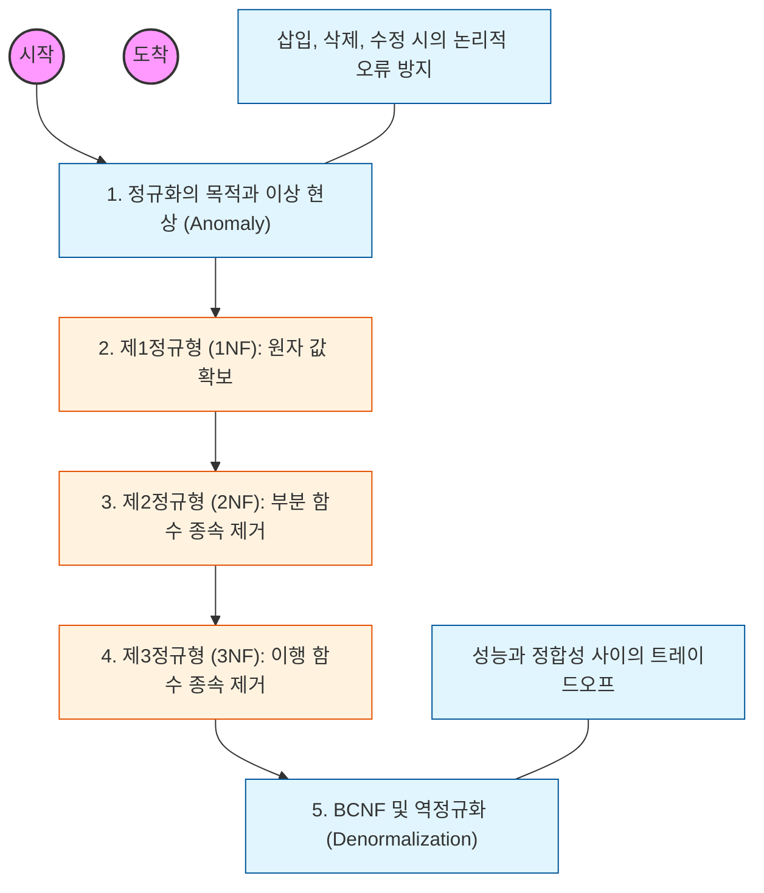

# 🧭 데이터베이스 정규화와 설계 최적화

> **해당 학습의 목표:** 정규화의 단계별 과정을 이해하고, 데이터의 중복을 제거하여 이상 현상(Anomaly)을 방지하는 설계를 할 수 있어야 함.

---

## 🛣️ Learning Roadmap

---

## 🔍 상세 학습 가이드

### **1. 정규화의 목적과 이상 현상 (Anomaly)**

* **내용:** 정규화를 하지 않았을 때 발생하는 삽입 이상, 삭제 이상, 수정 이상의 개념을 사례를 통해 이해해야 함.
* **Why?** 데이터의 중복으로 인해 정보가 누락되거나 모순이 생기는 현상을 원천 차단하기 위해 정규화 과정을 거쳐야 함.

### **2. 제1정규형 (1NF): 도메인의 원자성**

* **내용:** 한 칸(속성)에는 반드시 하나의 값만 들어가도록 분리하는 과정을 학습해야 함.
* **핵심:** 다중 값(Set, List 형태)을 제거하고 모든 속성이 원자 값(Atomic Value)을 갖도록 테이블을 구조화해야 함.

### **3. 제2정규형 (2NF): 부분 함수 종속성 제거**

* **내용:** 기본키가 복합키일 때, 기본키의 일부분에만 종속되는 속성을 분리하는 법을 익혀야 함.
* **핵심:** 완전 함수 종속(속성이 기본키 전체에 종속됨) 상태가 되도록 테이블을 쪼개어 관리해야 함.

### **4. 제3정규형 (3NF): 이행 함수 종속성 제거**

* **내용:** 기본키가 아닌 속성 간에 종속 관계가 존재하는 '이행적 종속'을 제거해야 함.
* **Why?** A->B, B->C 관계가 있을 때 A->C가 성립하는 관계를 분리하여 데이터의 독립성을 확보해야 함.

### **5. 역정규화 (Denormalization)**

* **내용:** 성능 향상을 위해 의도적으로 정규화 원칙을 깨고 테이블을 합치거나 중복 데이터를 허용하는 기법을 공부해야 함.
* **상황:** 너무 많은 조인(Join)으로 인해 시스템 응답 속도가 현저히 느려질 때, 조회 성능 최적화를 위해 신중하게 선택해야 함.

---

## 🔗 관련 참고 자료

* [Database Normalization (Wikipedia)](https://en.wikipedia.org/wiki/Database_normalization)
* [데이터베이스 설계와 구축 (이춘식 저)] - 실무 설계 관점의 필독서