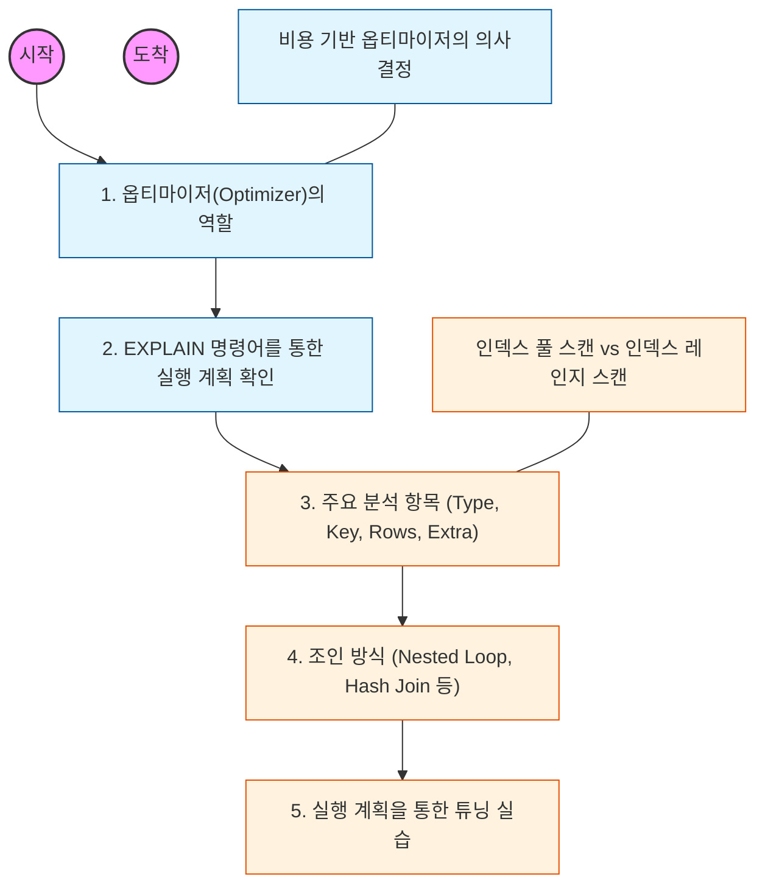

# 🧭 실행 계획: 쿼리 최적화의 핵심 지표

> **해당 학습의 목표:** DBMS가 데이터를 찾기 위해 수립한 전략(실행 계획)을 읽는 법을 익히고, 이를 바탕으로 비효율적인 쿼리를 찾아 개선할 수 있어야 함.

---

## 🛣️ Learning Roadmap

---

## 🔍 상세 학습 가이드

### **1. 옵티마이저(Optimizer)와 실행 계획**

* **내용:** SQL을 어떻게 실행할지 결정하는 '옵티마이저'의 개념과, 그 결과물인 '실행 계획'의 정의를 이해해야 함.
* **Why?** 똑같은 결과를 내는 SQL이라도 옵티마이저가 수립하는 경로에 따라 성능이 천차만별이 될 수 있음을 인지해야 함.

### **2. EXPLAIN 명령어 활용법**

* **내용:** `EXPLAIN` 또는 `EXPLAIN ANALYZE` 명령어를 사용하여 쿼리 분석 결과를 출력하는 법을 익혀야 함.
* **핵심:** 단순히 쿼리를 던지는 것에 그치지 않고, 시스템이 예측한 비용(Cost)과 실제 실행 시간을 비교 분석하는 습관을 들여야 함.

### **3. 실행 계획의 주요 지표 분석**

* **내용:** 출력된 테이블의 주요 컬럼 의미를 파악해야 함.
* **type:** 데이터 접근 방식 (system, const, ref, range, index, ALL 순으로 좋음)
* **key:** 실제로 사용된 인덱스
* **rows:** 쿼리 처리를 위해 조사해야 하는 예상 행 수
* **extra:** 추가 정보 (Using filesort, Using temporary 등 주의 깊게 봐야 함)

* **핵심:** `type`이 `ALL`(Full Table Scan)이거나 `Extra`에 `Using filesort`가 보인다면 즉시 개선 대상임을 인지해야 함.

### **4. 데이터 접근 및 조인 전략**

* **내용:** 인덱스를 범위로 읽는 `Index Range Scan`과 전체를 읽는 `Index Full Scan`의 성능 차이를 구분해야 함.
* **상황:** 중첩 루프 조인(Nested Loop Join)이나 해시 조인(Hash Join) 등 옵티마이저가 선택한 조인 방식이 적절한지 판단할 수 있어야 함.

### **5. 쿼리 튜닝 실무 적용**

* **내용:** 분석 결과를 바탕으로 인덱스를 추가하거나, 쿼리를 재작성하여 `rows` 수를 줄이고 `type`을 개선하는 실습을 해야 함.
* **핵심:** 힌트(Hint)를 사용하여 옵티마이저의 판단을 유도하는 법도 함께 학습하되, 가급적 옵티마이저가 스스로 최적의 길을 찾도록 쿼리를 정교하게 짜야 함.

---

## 🔗 관련 참고 자료

* [MySQL Explain Output Format](https://dev.mysql.com/doc/refman/8.0/en/explain-output.html)
* [Real MySQL 8.0 (백은빈, 이성욱 저)] - 실행 계획 분석의 끝판왕 교재