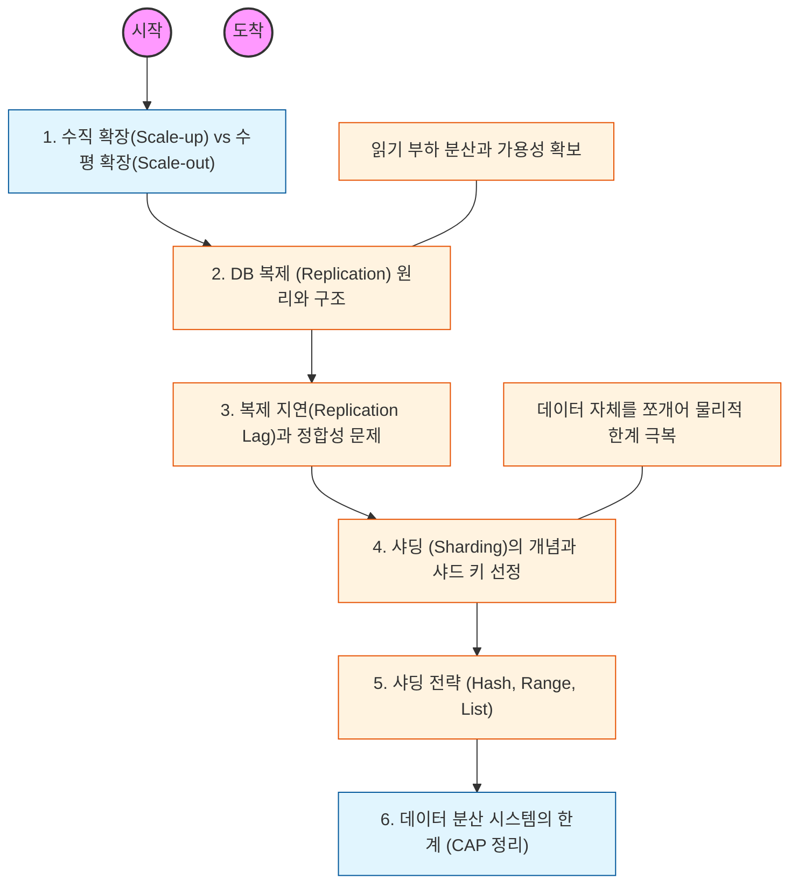

# 🧭 DB 복제와 샤딩: 확장 가능한 아키텍처 설계

> **해당 학습의 목표:** 데이터베이스의 부하를 분산하는 두 가지 핵심 기법의 차이를 이해하고, 데이터 유실 없는 안정적인 분산 시스템을 설계할 수 있어야 함.

---

## 🛣️ Learning Roadmap

---

## 🔍 상세 학습 가이드

### **1. DB 복제 (Replication)**

* **내용:** Master(Source) 노드에는 쓰기(Write) 작업을, Slave(Replica) 노드에는 읽기(Read) 작업을 분산하는 Master-Slave 구조를 이해해야 함.
* **Why?** 대부분의 서비스는 읽기 요청이 쓰기보다 훨씬 많기 때문에, 여러 대의 복제본을 두어 읽기 성능을 비약적으로 향상시키고 Master 장애 시 예비용(High Availability)으로 활용할 수 있어야 함.

### **2. 복제 지연과 데이터 일관성**

* **내용:** Master에서 수행된 작업이 Slave에 반영되기까지 발생하는 '복제 지연(Replication Lag)' 현상을 파악해야 함.
* **핵심:** 방금 글을 썼는데 목록에 보이지 않는 등의 정합성 문제를 해결하기 위해, 중요한 데이터는 Master에서 직접 읽는 등의 읽기 전략을 세워야 함.

### **3. 샤딩 (Sharding)**

* **내용:** 테이블의 데이터를 특정 기준에 따라 나누어 물리적으로 다른 서버에 분산 저장하는 수평 파티셔닝 기법을 학습해야 함.
* **Why?** 데이터량이 너무 많아 단일 서버의 저장 용량이나 인덱스 크기가 감당 안 될 때, 데이터를 물리적으로 쪼개어 성능을 유지하기 위해 도입해야 함.

### **4. 샤드 키(Shard Key) 선정 전략**

* **내용:** 데이터를 어떻게 나눌 것인지 결정하는 '샤드 키' 선정 방식(Range, Hash, Directory 기반 등)을 익혀야 함.
* **핵심:** 특정 서버에 데이터가 몰리는 'Hotspot' 문제를 방지하기 위해 데이터가 균등하게 분산될 수 있는 키를 선택하는 것이 가장 중요함.

### **5. 분산 시스템의 복잡성과 비용**

* **내용:** 여러 서버에 데이터가 흩어짐으로써 발생하는 조인(Join)의 어려움, 트랜잭션 유지의 곤란함(Global Transaction) 등의 단점을 인지해야 함.
* **상황:** 무조건적인 도입보다는 서비스 규모에 맞춰 복제부터 시작하고, 정말 필요한 시점에 샤딩을 검토하는 단계적 접근이 필요함.

---

## 🔗 관련 참고 자료

* [High Performance MySQL (Baron Schwartz 저)]