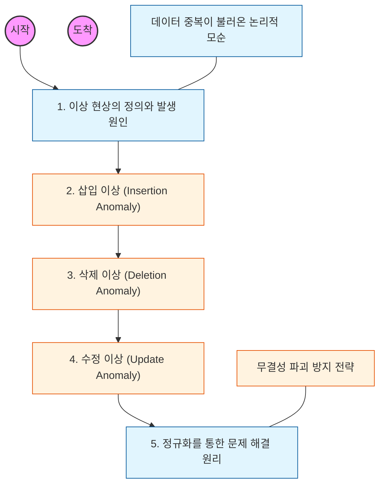

# 🧭 이상 현상: 정규화가 필요한 결정적 이유

> **해당 학습의 목표:** 데이터 중복으로 인해 발생하는 3가지 이상 현상을 정의하고, 이를 통해 정규화되지 않은 데이터베이스가 시스템에 끼치는 악영향을 이해해야 함.

---

## 🛣️ Learning Roadmap

---

## 🔍 상세 학습 가이드

### **1. 이상 현상의 근본 원인**

* **내용:** 한 테이블에 너무 많은 주제의 데이터를 모아두어 발생하는 **데이터 중복**이 모든 문제의 시작임을 이해해야 함.
* **Why?** 중복된 데이터가 존재하면 데이터를 관리(추가, 변경, 삭제)할 때 모든 복제본을 완벽하게 처리해야 하는데, 여기서 실수가 발생하면 데이터 불일치가 일어남.

### **2. 삽입 이상 (Insertion Anomaly)**

* **내용:** 데이터를 저장할 때 원하지 않는 정보까지 억지로 입력해야 하거나, 특정 정보가 없어서 데이터를 아예 삽입하지 못하는 현상을 학습해야 함.
* **예시:** 학생이 수강 신청을 해야만 학생 정보를 등록할 수 있는 테이블 구조에서, 아직 수강 신청을 안 한 신입생 정보를 넣을 수 없는 상황.

### **3. 삭제 이상 (Deletion Anomaly)**

* **내용:** 한 쪽의 정보를 삭제했을 때, 유지되어야 할 다른 정보까지 연쇄적으로 삭제되어 정보가 유실되는 현상을 이해해야 함.
* **예시:** 특정 과목의 수강 기록을 삭제했는데, 그 과목을 듣던 유일한 학생의 인적 사항까지 함께 지워져 버리는 상황.

### **4. 수정 이상 (Update Anomaly)**

* **내용:** 중복된 데이터 중 일부만 수정되어 데이터 간의 모순(Inconsistency)이 발생하는 현상을 파악해야 함.
* **예시:** 한 학생의 전화번호가 여러 행에 중복 저장되어 있을 때, 하나의 행만 수정하면 같은 학생인데 전화번호가 서로 다르게 조회되는 상황.

### **5. 해결책: 무결성 확보를 위한 분리**

* **내용:** 이러한 이상 현상을 해결하기 위해 테이블을 주제별로 쪼개는 **정규화**가 왜 필요한지 결론을 내려야 함.
* **핵심:** "하나의 테이블에는 하나의 주제만 담는다"는 원칙이 이상 현상을 방지하는 가장 강력한 무기임을 인지해야 함.

---

## 🔗 관련 참고 자료

* [Database Management Systems - Anomalies](https://en.wikipedia.org/wiki/Database_normalization%23Anomalies)
* [데이터베이스 개론 (이석호 저)]