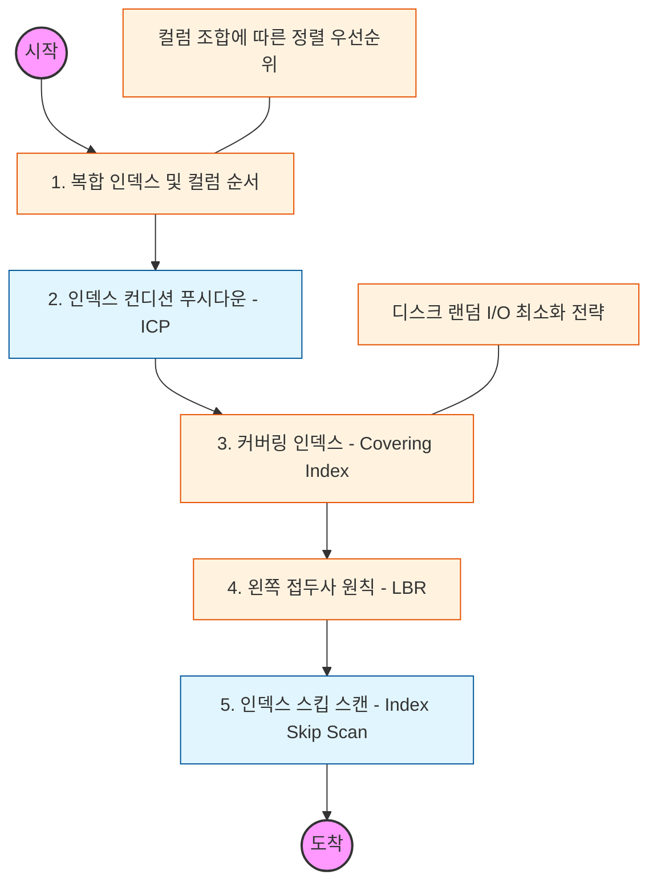

# 🧭 인덱스 심화: 성능 최적화의 정점

> **해당 학습의 목표:** 다중 컬럼 인덱스의 정렬 원리를 파악하고, 테이블 접근 없이 인덱스만으로 데이터를 반환하는 커버링 인덱스 등 고난도 최적화 기법을 습득해야 함.

---

## 🛣️ Learning Roadmap

---

## 🔍 상세 학습 가이드

### **1. 복합 인덱스(Composite Index)와 정렬 순서**

* **내용:** 두 개 이상의 컬럼을 합쳐서 만드는 인덱스의 내부 정렬 방식을 이해해야 함.
* **핵심:** **"첫 번째 컬럼이 같을 때만 두 번째 컬럼이 정렬된다"**는 원리를 파악해야 함. 따라서 카디널리티가 높은 컬럼을 앞에 두는 것이 일반적이나, `WHERE` 조건과 `ORDER BY` 절에 따라 전략적으로 배치해야 함.

### **2. 가장 왼쪽 접두사 원칙 (Leftmost Bound Rule)**

* **내용:** 복합 인덱스 사용 시 반드시 첫 번째 컬럼이 조건절에 포함되어야 인덱스가 유효하게 작동하는 원리를 학습해야 함.
* **Why?** (A, B, C)로 구성된 인덱스에서 B와 C만으로 검색하면 인덱스 효율을 전혀 누릴 수 없음을 인지해야 함.

### **3. 커버링 인덱스 (Covering Index)**

* **내용:** 쿼리가 필요로 하는 모든 컬럼이 인덱스에 포함되어 있어, 실제 데이터 페이지(Heap/Data Area)에 접근하지 않고 인덱스 레벨에서 처리를 끝내는 기법임.
* **핵심:** 실행 계획의 `Extra` 항목에 `Using index`라고 표시되는지 확인해야 함. 이는 디스크 랜덤 I/O를 획기적으로 줄여 성능을 극대화함.

### **4. 인덱스 컨디션 푸시다운 (ICP)**

* **내용:** 인덱스 범위 내에서 필터링할 수 있는 조건을 스토리지 엔진 레벨로 내려서 데이터 읽기를 최소화하는 최적화 기법임.
* **상황:** MySQL 5.6부터 도입된 이 기능이 어떻게 `Using index condition`으로 나타나는지 실행 계획을 통해 확인해야 함.

### **5. 인덱스 스킵 스캔 (Index Skip Scan)**

* **내용:** 복합 인덱스의 앞쪽 컬럼이 조건절에 없더라도, 해당 컬럼의 유니크한 값의 개수가 적으면 옵티마이저가 인덱스를 건너뛰며 탐색하는 기술임.
* **Why?** 인덱스 재구성 없이도 쿼리 성능을 보전할 수 있는 최신 옵티마이저의 동작 방식을 이해해야 함.

---

## 🔗 관련 참고 자료

* [MySQL High Performance - Advanced Indexing](https://dev.mysql.com/doc/refman/8.0/en/optimization-indexes.html)
* [Real MySQL 8.0 (2권) - 인덱스 최적화 파트]