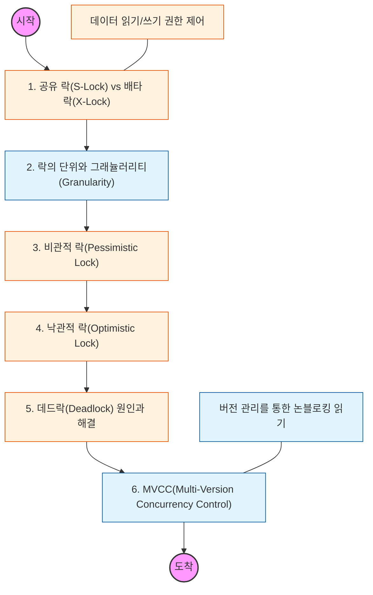

# 🧭 DB 락과 동시성: 데이터 정합성 사수 전략

> **해당 학습의 목표:** 자원에 대한 접근을 제한하는 다양한 락의 종류를 파악하고, 성능과 데이터 무결성 사이의 균형을 맞추는 비관적/낙관적 락 설계 능력을 갖추어야 함.

---

## 🛣️ Learning Roadmap

---

## 🔍 상세 학습 가이드

### **1. 락의 기본 종류: 공유 락과 배타 락**

* **내용:** 여러 명이 동시에 읽을 수 있는 **공유 락(Shared Lock)**과 한 명만 수정할 수 있는 **배타 락(Exclusive Lock)**의 차이를 이해해야 함.
* **Why?** 읽기 작업끼리는 서로 방해하지 않지만, 쓰기 작업이 시작되면 다른 읽기/쓰기 작업이 대기해야 하는 호환성 매트릭스를 파악해야 함.

### **2. 락의 범위 (Granularity)**

* **내용:** 데이터베이스 전체, 테이블, 페이지, 행(Row) 등 어느 범위까지 락을 걸 것인지에 따른 장단점을 분석해야 함.
* **핵심:** 락의 범위가 세밀할수록(행 단위) 동시성은 높아지지만 관리 오버헤드가 증가하고, 범위가 넓을수록(테이블 단위) 관리는 쉽지만 동시성이 떨어짐을 이해해야 함.

### **3. 비관적 락(Pessimistic Lock) 전략**

* **내용:** 데이터 충돌이 자주 발생할 것이라고 가정하고, 데이터를 읽는 시점에 미리 락을 거는 방식임.
* **핵심:** `SELECT ... FOR UPDATE` 문법을 사용하여 자원을 선점하는 법을 익혀야 하며, 무결성이 절대적으로 중요한 금융 결제 시스템 등에서의 활용 사례를 확인해야 함.

### **4. 낙관적 락(Optimistic Lock) 전략**

* **내용:** 데이터 충돌이 드물 것이라고 가정하고, 락을 거는 대신 데이터의 버전(Version)이나 타임스탬프를 비교하여 충돌을 감지하는 방식임.
* **핵심:** 애플리케이션 레벨에서 구현되며, 수정 시점에 버전이 변경되었는지 확인하여 충돌 시 롤백하거나 재시도하는 로직을 설계해야 함.

### **5. 데드락(Deadlock)과 해소**

* **내용:** 두 개 이상의 트랜잭션이 서로가 가진 락을 기다리며 무한 대기에 빠지는 상황을 학습해야 함.
* **상황:** 트랜잭션을 짧게 유지하고, 자원 접근 순서를 일정하게 맞추는 등 데드락을 예방하고 탐지하는 전략을 세워야 함.

### **6. MVCC (다중 버전 동시성 제어)**

* **내용:** 락을 사용하지 않고도 읽기 일관성을 보장하기 위해 데이터의 이전 버전(Snapshot)을 관리하는 기술임.
* **Why?** "읽기 작업은 쓰기 작업을 방해하지 않는다"는 현대적 DBMS(MySQL InnoDB 등)의 고성능 동시성 처리 핵심 원리를 이해해야 함.