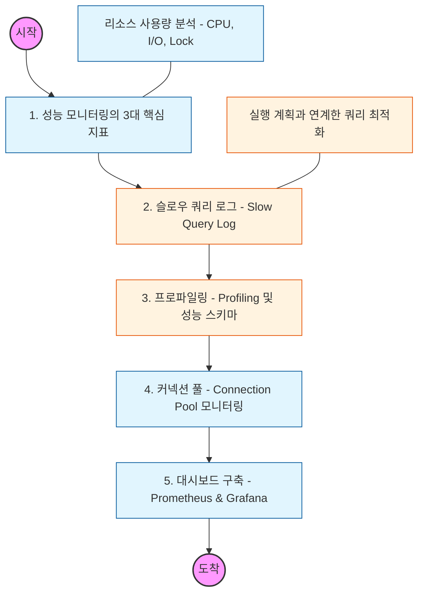

# 🧭 DB 성능 모니터링: 데이터 기반의 튜닝 전략

> **해당 학습의 목표:** 슬로우 쿼리를 식별하고, CPU/Memory/Disk I/O 지표를 분석하여 시스템의 병목 현상을 진단 및 해결할 수 있어야 함.

---

## 🛣️ Learning Roadmap

---

## 🔍 상세 학습 가이드

### **1. 성능 모니터링의 핵심 지표**

* **내용:** 서비스 성능에 직접적인 영향을 주는 시스템 자원을 파악해야 함.
* **CPU:** 복잡한 연산, 정렬(Filesort), 조인이 많을 때 급증함.
* **Disk I/O:** 인덱스가 없어 전체 테이블을 읽거나(Full Scan), 스왑 발생 시 급증함.
* **Memory:** 버퍼 풀(Buffer Pool) 크기가 적절한지, 캐시 적중률(Hit Rate)이 높은지 확인해야 함.

### **2. 슬로우 쿼리 로그 (Slow Query Log)**

* **내용:** 설정한 시간(예: 1초)보다 오래 걸리는 쿼리를 기록하고 분석하는 법을 익혀야 함.
* **핵심:** 가장 자주 실행되면서도 느린 쿼리를 우선순위로 정해 `EXPLAIN`으로 분석하고 인덱스를 튜닝해야 함.

### **3. 프로파일링 (Profiling)**

* **내용:** 특정 쿼리가 실행되는 동안 각 단계(Sending data, Sorting, Statistics 등)에서 시간이 얼마나 소요되는지 상세히 분석해야 함.
* **Why?** 네트워크 전송 시간이 문제인지, 디스크에서 데이터를 읽어오는 시간이 문제인지 정확한 원인을 파악하기 위함임.

### **4. 커넥션 풀 (Connection Pool) 모니터링**

* **내용:** 애플리케이션과 DB 사이의 연결 통로인 커넥션 풀의 활성 상태를 확인해야 함.
* **상황:** 커넥션이 부족하여 대기 시간이 길어지는 현상(Wait Time)이나, 반대로 너무 많아서 DB 메모리를 과하게 사용하는 현상을 방지해야 함.

### **5. 모니터링 도구와 자동화**

* **내용:** `Prometheus`로 지표를 수집하고 `Grafana`로 시각화하거나, 클라우드 환경(AWS RDS)의 `Performance Insights`를 활용하는 법을 익혀야 함.
* **핵심:** 특정 임계치(Critical Point)를 넘었을 때 개발자에게 즉시 알림(Alerting)이 오도록 설정하여 장애에 선제적으로 대응해야 함.

---

## 🔗 관련 참고 자료

* [MySQL Performance Schema Documentation](https://dev.mysql.com/doc/refman/8.0/en/performance-schema.html)
* [AWS RDS Performance Insights Guide](https://docs.aws.amazon.com/AmazonRDS/latest/UserGuide/USER_PerfInsights.html)