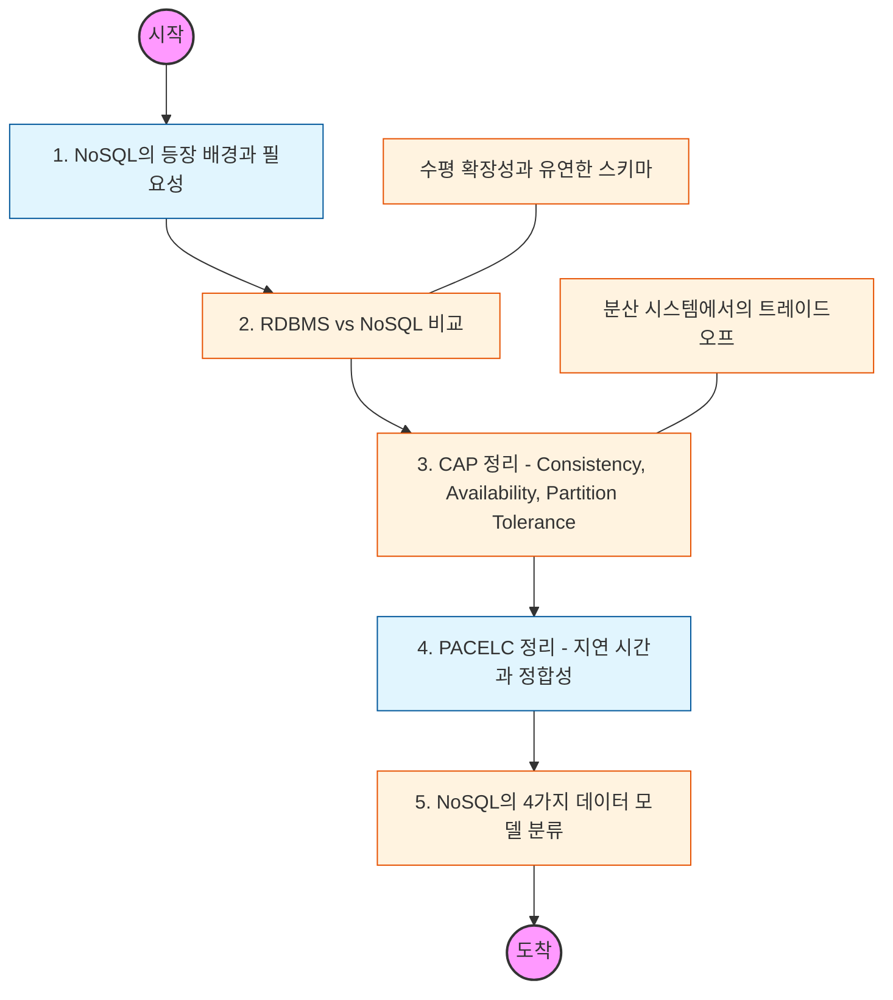

# 🧭 NoSQL 기초: 분산 데이터베이스의 이해

> **해당 학습의 목표:** RDBMS와 NoSQL의 차이점을 명확히 이해하고, 분산 시스템의 설계 원칙인 CAP 정리와 데이터 모델에 따른 NoSQL 분류를 마스터해야 함.

---

## 🛣️ Learning Roadmap

---

## 🔍 상세 학습 가이드

### **1. NoSQL의 등장 배경**

* **내용:** 빅데이터의 시대가 오면서 단일 서버의 한계(Scale-up)와 고정된 스키마가 주는 불편함을 어떻게 해결하려 했는지 학습해야 함.
* **Why?** 초당 수만 건의 쓰기 작업이나 소셜 미디어처럼 비정형적인 데이터를 처리하기 위해 RDBMS의 엄격한 제약을 완화할 필요가 있었음을 이해해야 함.

### **2. RDBMS vs NoSQL 핵심 비교**

* **내용:** 두 진영의 차이를 표로 정리하여 숙지해야 함.
* **RDBMS:** 강력한 일관성(ACID), 고정된 스키마, 조인(Join) 가능.
* **NoSQL:** 높은 확장성, 유연한 스키마(Schemaless), 조인보다는 비정규화 선호.

* **핵심:** 무조건 NoSQL이 좋은 것이 아니라, 비즈니스의 성격(금융 vs 로그 분석)에 따라 선택해야 함을 인지해야 함.

### **3. CAP 정리 (CAP Theorem)**

* **내용:** 분산 환경에서 다음 세 가지를 동시에 모두 만족할 수 없다는 원리를 이해해야 함.
* **Consistency(일관성):** 모든 노드가 같은 시간에 같은 데이터를 보여줌.
* **Availability(가용성):** 일부 노드 장애 시에도 응답 가능함.
* **Partition Tolerance(분할 내성):** 노드 간 통신 장애 시에도 시스템 유지됨.

* **핵심:** 보통 P(분할 내성)는 필수이므로, **CP**(일관성 중시)와 **AP**(가용성 중시) 중 무엇을 선택할지 결정하는 기준을 세워야 함.

### **4. NoSQL의 4가지 데이터 모델**

* **내용:** 저장 방식에 따른 대표적인 유형들을 파악해야 함.
1. **Key-Value:** 가장 단순하고 빠름 (예: Redis, Riak)
2. **Document:** JSON 형태로 저장, 유연함 (예: MongoDB, CouchDB)
3. **Column-Family:** 대량의 데이터 읽기/쓰기에 최적 (예: Cassandra, HBase)
4. **Graph:** 데이터 간의 관계를 노드와 간선으로 표현 (예: Neo4j)

---

## 🔗 관련 참고 자료

* [Introduction to NoSQL (MongoDB)](https://www.mongodb.com/nosql-explained)