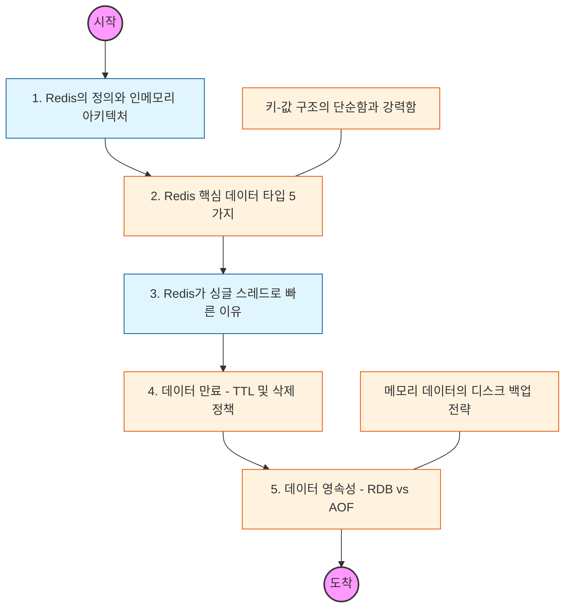

# 🧭 Redis 기초: 인메모리 데이터베이스의 활용

> **해당 학습의 목표:** 메모리 기반 저장소인 Redis의 특징을 파악하고, 다양한 데이터 타입을 상황에 맞게 선택하여 고성능 애플리케이션을 설계할 수 있어야 함.

---

## 🛣️ Learning Roadmap

---

## 🔍 상세 학습 가이드

### **1. Redis의 정의와 특징**

* **내용:** 디스크가 아닌 메인 메모리(RAM)에 데이터를 저장하여 읽기/쓰기 속도가 극단적으로 빠른 특징을 이해해야 함.
* **Why?** 데이터베이스 부하를 줄이기 위한 캐싱(Caching) 레이어로서의 역할과 휘발성 데이터 관리의 중요성을 파악해야 함.

### **2. 핵심 데이터 타입 (Data Types)**

* **내용:** 단순히 문자열만 저장하는 것이 아니라 다양한 구조를 지원함을 학습해야 함.
* **Strings:** 가장 기본적인 키-값 쌍.
* **Lists:** Linked List 구조, 메시지 큐로 활용.
* **Sets:** 중복 없는 집합, 친구 목록 등에 활용.
* **Hashes:** 필드-값 쌍을 가진 객체 저장.
* **Sorted Sets (ZSET):** 가중치(Score)에 따른 정렬 지원, 랭킹 시스템에 필수.

### **3. 싱글 스레드 모델과 비동기 I/O**

* **내용:** Redis가 싱글 스레드로 동작하면서도 초당 수십만 건의 요청을 처리하는 원리(Event Loop)를 이해해야 함.
* **핵심:** 한 번에 하나의 명령어만 처리하므로, `KEYS *`와 같이 시간이 오래 걸리는 명령어가 전체 시스템을 멈추게(Blocking) 할 수 있음을 주의해야 함.

### **4. 유효 기간(TTL)과 메모리 관리**

* **내용:** 특정 시간 후에 데이터를 자동으로 삭제하는 `EXPIRE`(TTL) 설정법을 익혀야 함.
* **상황:** 메모리가 가득 찼을 때 어떤 데이터를 먼저 지울지 결정하는 정책(LRU, LFU 등 Maxmemory Policy)을 파악해야 함.

### **5. 데이터 영속성 (Persistence)**

* **내용:** 메모리 기반임에도 데이터를 디스크에 저장하여 복구할 수 있는 두 가지 방법을 비교해야 함.
* **RDB (Snapshotting):** 특정 시점의 메모리 스냅샷을 파일로 저장.
* **AOF (Append Only File):** 모든 쓰기 명령을 로그로 기록.

* **핵심:** 성능(RDB)과 데이터 안전성(AOF) 사이의 균형을 맞추는 법을 배워야 함.

---

## 🔗 관련 참고 자료

* [Redis University](https://university.redis.com/)