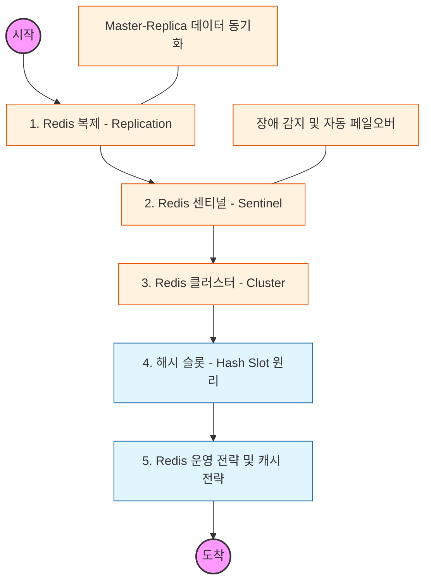

# 🧭 Redis 심화: 고가용성과 클러스터링

> **해당 학습의 목표:** Redis의 복제 메커니즘을 이해하고, 장애 발생 시 자동으로 복구하는 센티널과 데이터를 여러 서버에 분산하는 클러스터 구조를 마스터해야 함.

---

## 🛣️ Learning Roadmap

---

## 🔍 상세 학습 가이드

### **1. Redis 복제 (Replication)**

* **내용:** Master 노드의 데이터를 실시간으로 Replica(Slave) 노드에 복사하는 비동기 복제 방식을 학습해야 함.
* **Why?** Master 노드에 장애가 발생했을 때 데이터를 보존하고, 읽기 요청을 Replica로 분산하여 성능을 높이기 위함임.

### **2. Redis 센티널 (Sentinel)**

* **내용:** 여러 대의 센티널 노드가 Master 노드를 감시하다가, 장애가 감지되면 Replica 중 하나를 새로운 Master로 승격시키는 자동 페일오버(Failover)를 이해해야 함.
* **핵심:** 과반수 찬성(Quorum) 원리를 통해 장애 여부를 결정하는 합의 알고리즘의 기초를 파악해야 함.

### **3. Redis 클러스터 (Cluster)**

* **내용:** 데이터를 여러 서버에 수평으로 분할(Sharding)하여 저장하는 클러스터 구조를 익혀야 함.
* **Why?** 단일 서버의 메모리 용량을 초과하는 대규모 데이터를 처리하고, 쓰기 부하를 여러 노드로 분산하기 위해 필수적임.

### **4. 해시 슬롯 (Hash Slot)**

* **내용:** Redis 클러스터가 데이터를 분산하는 기준인 16,384개의 해시 슬롯 개념을 이해해야 함.
* **핵심:** 키를 해싱하여 어떤 슬롯에 할당할지 결정하고, 노드 추가/제거 시 슬롯이 어떻게 이동(Resharding)되는지 파악해야 함.

### **5. 실무 캐시 전략 (Caching Strategies)**

* **내용:** 애플리케이션에서 Redis를 활용하는 다양한 패턴을 숙지해야 함.
* **Look Aside (Cache Aside):** 앱이 먼저 캐시를 확인하고 없으면 DB에서 가져옴.
* **Write Back:** 데이터를 캐시에 먼저 쓰고 나중에 DB에 일괄 저장.

* **상황:** 캐시 쇄도(Cache Stampede)나 캐시 관통(Cache Penetration) 같은 부작용을 막기 위한 방어 로직을 설계해야 함.