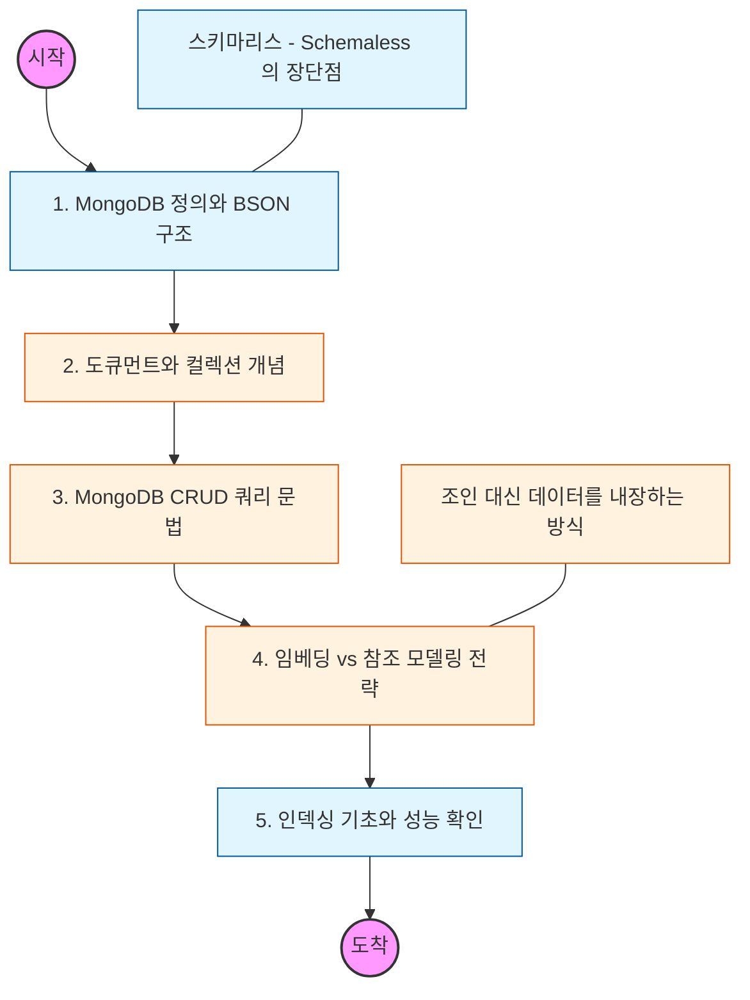

# 🧭 MongoDB 기초: 유연한 도큐먼트 데이터 모델링

> **해당 학습의 목표:** JSON 형태의 도큐먼트 구조인 BSON의 특징을 이해하고, 스키마 설계의 자유로움을 바탕으로 CRUD 쿼리를 자유자재로 구사할 수 있어야 합니다.

---

## 🛣️ Learning Roadmap

---

## 🔍 상세 학습 가이드

### **1. MongoDB의 핵심: 도큐먼트와 BSON**

* **내용:** 데이터를 행(Row)이 아닌 도큐먼트(Document) 단위로 저장하며, 내부적으로는 이진 JSON 형태인 **BSON** 형식을 사용하는 것을 이해해야 합니다.
* **Why?** 다양한 데이터 타입을 지원하면서도 JSON보다 읽기/쓰기 성능이 최적화된 구조임을 인지해야 합니다.

### **2. 계층 구조 이해 (Database > Collection > Document)**

* **내용:** RDBMS의 Table은 **Collection**으로, Row는 **Document**로 대응되는 구조를 파악해야 합니다.
* **핵심:** 한 컬렉션 안에서도 도큐먼트마다 서로 다른 필드를 가질 수 있는 **Schemaless**의 유연함을 실습해보세요.

### **3. 강력한 쿼리 언어 (MQL)**

* **내용:** SQL 대신 사용하는 MongoDB Query Language(MQL)의 기본 문법을 익혀야 합니다.
* **Create:** `insertOne`, `insertMany`
* **Read:** `find`와 다양한 연산자 (`$gt`, `$in`, `$or` 등)
* **Update:** `updateOne`, `$set`, `$push` (배열 수정)
* **Delete:** `deleteOne`, `deleteMany`

### **4. 데이터 모델링: Embedding vs Reference**

* **내용:** 관계형 DB처럼 ID로 참조할 것인지(`Reference`), 아니면 연관 데이터를 도큐먼트 안에 직접 넣을 것인지(`Embedding`) 결정하는 전략을 학습해야 합니다.
* **핵심:** 잦은 조인이 필요한 데이터는 **Embedding**을 통해 한 번의 쿼리로 가져오는 것이 MongoDB다운 설계임을 이해해야 합니다.

### **5. 인덱싱과 쿼리 분석**

* **내용:** 도큐먼트 검색 속도를 높이기 위한 싱글 인덱스 및 복합 인덱스 생성법을 익혀야 합니다.
* **상황:** 쿼리 실행 시 `explain()` 함수를 사용하여 실제로 인덱스를 타는지, 아니면 전체 컬렉션을 스캔(COLLSCAN)하는지 확인하는 법을 숙지해야 합니다.

---

## 🔗 관련 참고 자료

* [MongoDB Manual - CRUD Operations](https://www.mongodb.com/docs/manual/crud/)
* [MongoDB University (무료 입문 강의)](https://learn.mongodb.com/)