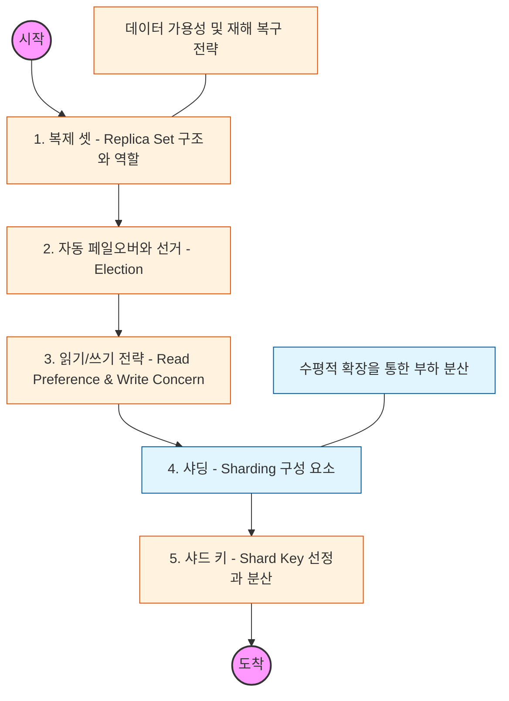

# 🧭 MongoDB 심화: 복제 셋과 샤딩을 통한 무한 확장

> **해당 학습의 목표:** 데이터 유실을 방지하는 복제 메커니즘을 이해하고, 수평적 확장의 정점인 샤딩을 통해 테라바이트급 데이터를 처리하는 구조를 설계할 수 있어야 합니다.

---

## 🛣️ Learning Roadmap

---

## 🔍 상세 학습 가이드

### **1. 복제 셋 (Replica Set): 고가용성의 기초**

* **내용:** 하나의 Primary 노드와 여러 개의 Secondary 노드로 구성된 복제 셋의 작동 원리를 파악해야 합니다.
* **Why?** 데이터의 동일한 복사본을 여러 서버에 유지하여, 서버 한 대가 고장 나도 데이터 서비스가 중단되지 않게 하기 위함입니다.

### **2. 선거(Election)와 자동 페일오버**

* **내용:** Primary 노드에 장애가 발생했을 때, 나머지 Secondary 노드들이 투표를 통해 새로운 Primary를 선출하는 과정을 이해해야 합니다.
* **핵심:** '정족수(Quorum)' 개념을 익히고, 왜 복제 셋의 멤버 수를 홀수로 구성하는 것이 권장되는지 파악하세요.

### **3. Read Preference와 Write Concern**

* **내용:** 서비스 성격에 맞춰 데이터의 정합성과 성능 사이의 균형을 조절하는 설정을 학습해야 합니다.
* **Read Preference:** 읽기 요청을 Primary에서 할지, 가까운 Secondary에서 할지 결정.
* **Write Concern:** 데이터가 몇 개의 노드에 기록되어야 '성공'으로 간주할지 설정.

* **상황:** 데이터 유실이 절대 안 되는 금융 데이터와 성능이 중요한 로그 데이터의 설정 차이를 시뮬레이션해 보세요.

### **4. 샤딩 (Sharding): 데이터 분산 저장**

* **내용:** 데이터를 여러 서버(Shard)에 나누어 저장하는 분산 구조를 익혀야 합니다.
* **핵심:** 쿼리 라우터인 **Mongos**, 설정을 관리하는 **Config Server**, 실제 데이터를 가진 **Shard**의 유기적인 관계를 이해해야 합니다.

### **5. 샤드 키 (Shard Key) 전략**

* **내용:** 데이터를 나누는 기준인 샤드 키에 따라 시스템의 성능이 결정됩니다.
* **Ranged Sharding:** 특정 범위별로 데이터 저장.
* **Hashed Sharding:** 해시 함수를 통해 데이터를 고르게 분산.

* **Why?** 특정 샤드에만 데이터가 몰리는 'Hotspot' 현상을 방지하기 위해 서비스의 쿼리 패턴에 맞는 최적의 키를 선정하는 능력을 길러야 합니다.

---

## 🔗 관련 참고 자료

* [MongoDB Manual - Replication](https://www.mongodb.com/docs/manual/replication/)
* [MongoDB Manual - Sharding](https://www.mongodb.com/docs/manual/sharding/)