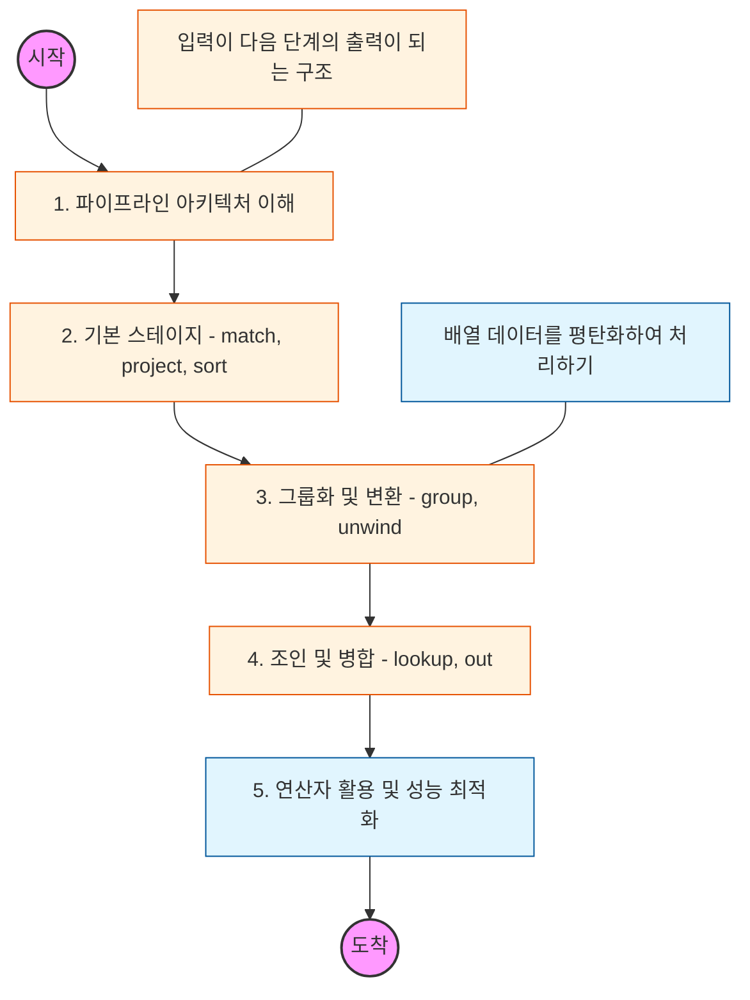

# 🧭 MongoDB Aggregation: 데이터 분석 파이프라인 마스터

> **해당 학습의 목표:** 파이프라인(Pipeline)과 스테이지(Stage)의 개념을 이해하고, 복잡한 비즈니스 로직을 DB 레벨에서 고속으로 처리하는 분석 쿼리를 작성할 수 있어야 합니다.

---

## 🛣️ Learning Roadmap

---

## 🔍 상세 학습 가이드

### **1. 파이프라인(Pipeline) 아키텍처**

* **내용:** 데이터가 여러 단계(Stage)를 거치며 가공되어 최종 결과가 나오는 '공정 라인' 개념을 이해해야 합니다.
* **Why?** 각 스테이지는 독립적이며, 앞 단계에서 필터링 된 데이터가 뒷 단계의 입력값이 되어 연산 효율을 극대화합니다.

### **2. 핵심 필터링 스테이지: $match, $project, $sort**

* **내용:** 가장 빈번하게 사용되는 기초 스테이지를 익힙니다.
* **$match:** 조건에 맞는 도큐먼트 필터링 (SQL의 WHERE 역할).
* **$project:** 필요한 필드만 선택하거나 새로운 필드 계산 생성 (SQL의 SELECT 역할).
* **$sort:** 데이터 정렬.

* **핵심:** `$match`를 파이프라인 최상단에 배치하여 처리할 데이터 양을 미리 줄이는 것이 성능의 핵심입니다.

### **3. 데이터 그룹화와 배열 처리: $group, $unwind**

* **내용:** 통계 산출의 핵심 스테이지입니다.
* **$group:** 특정 키를 기준으로 데이터를 묶고 합계, 평균 등을 계산.
* **$unwind:** 도큐먼트 내의 배열 필드를 분해하여 각 요소를 개별 도큐먼트로 변환.

* **상황:** "사용자별 주문 목록(배열)"을 `$unwind`로 풀어내고, `$group`으로 "사용자별 총 구매 금액"을 계산하는 패턴을 실습하세요.

### **4. 관계 연결과 결과 저장: $lookup, $out**

* **내용:** 다른 컬렉션과의 결합 및 결과 저장을 학습합니다.
* **$lookup:** 다른 컬렉션과 Left Outer Join을 수행.
* **$out / $merge:** 집계 결과를 새로운 컬렉션에 저장하거나 기존 컬렉션에 병합.

* **핵심:** MongoDB는 비정규화를 권장하지만, 분리된 데이터를 분석할 때 `$lookup`은 필수적인 도구입니다.

### **5. 연산자 활용 및 성능 최적화**

* **내용:** `$addFields`, `$facet`(다중 파이프라인), `$bucket` 등 고도화된 연산자를 학습합니다.
* **최적화:** 인덱스를 탈 수 있는 스테이지(`$match`, `$sort`)를 전면에 배치하고, 메모리 제한(100MB)을 초과할 경우 `allowDiskUse` 옵션을 사용하는 법을 숙지해야 합니다.

---

## 🔗 관련 참고 자료

* [MongoDB Manual - Aggregation Operations](https://www.mongodb.com/docs/manual/aggregation/)
* [Practical MongoDB Aggregation (e-book)](https://www.practical-mongodb-aggregations.com/)