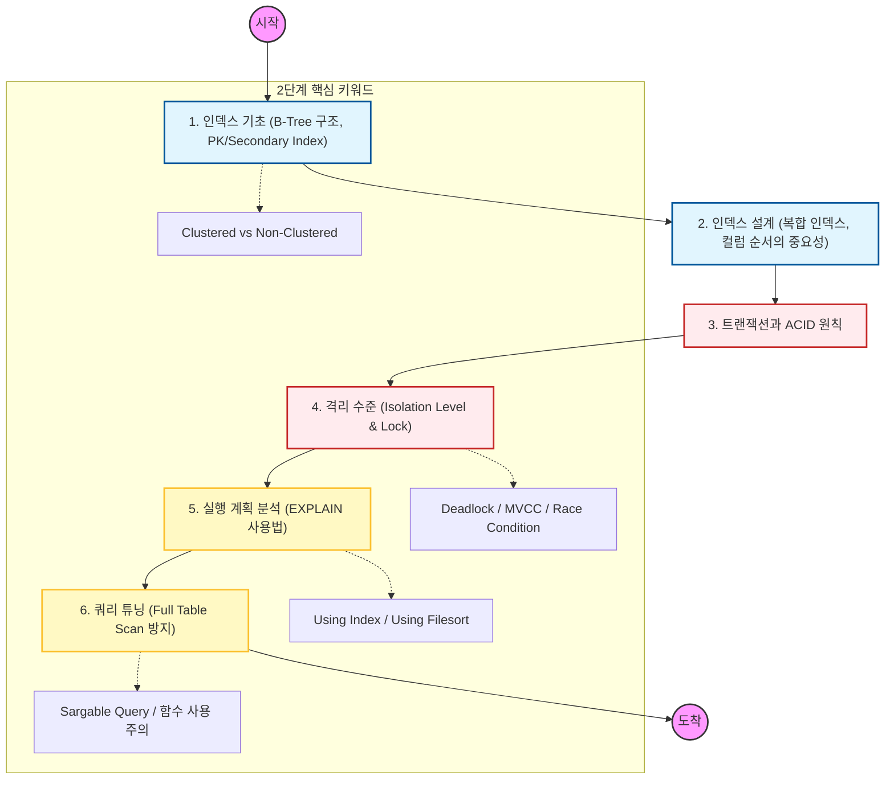

2단계의 핵심 키워드는 **인덱스**와 **트랜잭션**. 쿼리 성능을 끌어올리고, 동시성 상황에서도 데이터가 꼬이지 않게 만드는 방법을 학습.

```mermaid
graph TD
    %% 스타일 정의
    classDef point fill:#f9f,stroke:#333,stroke-width:2px;
    classDef index fill:#e1f5fe,stroke:#01579b,stroke-width:2px;
    classDef transaction fill:#ffebee,stroke:#c62828,stroke-width:2px;
    classDef analysis fill:#fff9c4,stroke:#fbc02d,stroke-width:2px;

    Start((시작)):::point --> IndexBasic["1. 인덱스 기초 (B-Tree 구조, PK/Secondary Index)"]:::index
    IndexBasic --> IndexDesign["2. 인덱스 설계 (복합 인덱스, 컬럼 순서의 중요성)"]:::index
    IndexDesign --> Transaction["3. 트랜잭션과 ACID 원칙"]:::transaction
    Transaction --> Isolation["4. 격리 수준 (Isolation Level & Lock)"]:::transaction
    Isolation --> Explain["5. 실행 계획 분석 (EXPLAIN 사용법)"]:::analysis
    Explain --> Optimization["6. 쿼리 튜닝 (Full Table Scan 방지)"]:::analysis
    Optimization --> Finish((도착)):::point

    %% 상세 키워드 연결
    subgraph "2단계 핵심 키워드"
    IndexBasic -.-> K1["Clustered vs Non-Clustered"]
    Isolation -.-> K2["Deadlock / MVCC / Race Condition"]
    Explain -.-> K3["Using Index / Using Filesort"]
    Optimization -.-> K4["Sargable Query / 함수 사용 주의"]
    end
```
