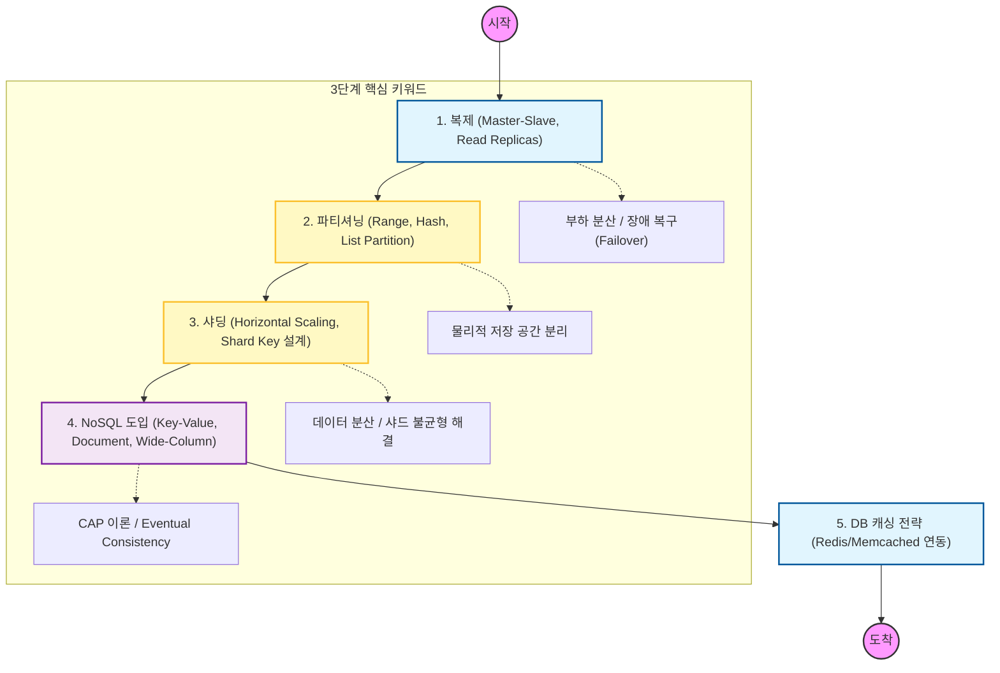

단계의 핵심은 **분산**과 **가용성**. 서버 한 대가 죽어도 서비스는 유지되어야 하고, 수억 건의 데이터도 빠르게 조회할 수 있는 구조를 학습해야 함.

```mermaid
graph TD
    %% 스타일 정의
    classDef point fill:#f9f,stroke:#333,stroke-width:2px;
    classDef replication fill:#e1f5fe,stroke:#01579b,stroke-width:2px;
    classDef sharding fill:#fff9c4,stroke:#fbc02d,stroke-width:2px;
    classDef nosql fill:#f3e5f5,stroke:#7b1fa2,stroke-width:2px;

    Start((시작)):::point --> Replication["1. 복제 (Master-Slave, Read Replicas)"]:::replication
    Replication --> Partitioning["2. 파티셔닝 (Range, Hash, List Partition)"]:::sharding
    Partitioning --> Sharding["3. 샤딩 (Horizontal Scaling, Shard Key 설계)"]:::sharding
    Sharding --> NoSQL_Basic["4. NoSQL 도입 (Key-Value, Document, Wide-Column)"]:::nosql
    NoSQL_Basic --> Cache_Strategy["5. DB 캐싱 전략 (Redis/Memcached 연동)"]:::replication
    Cache_Strategy --> Finish((도착)):::point

    %% 상세 키워드 연결
    subgraph "3단계 핵심 키워드"
    Replication -.-> K1["부하 분산 / 장애 복구(Failover)"]
    Sharding -.-> K2["데이터 분산 / 샤드 불균형 해결"]
    NoSQL_Basic -.-> K3["CAP 이론 / Eventual Consistency"]
    Partitioning -.-> K4["물리적 저장 공간 분리"]
    end
```
